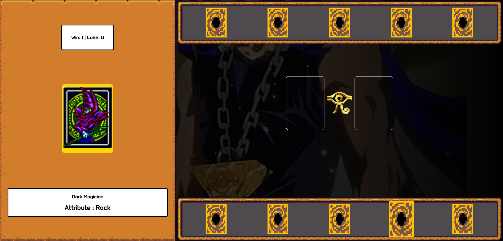

# Jokenpo Game 👊🖐️✌️

Project developed at the Game Development Bootcamp.
Jo-ken-po style card game, based on the Yu-Gi-Oh theme.

To play, [click here](https://maripirczak.github.io/jokenpo-game/). 

   

## Technologies Used

 
  
  
